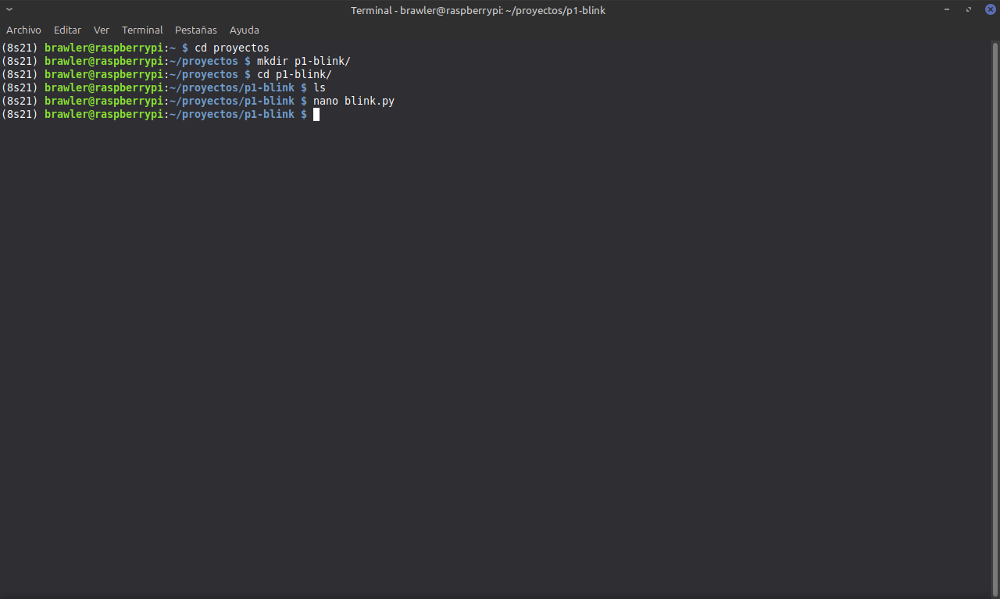
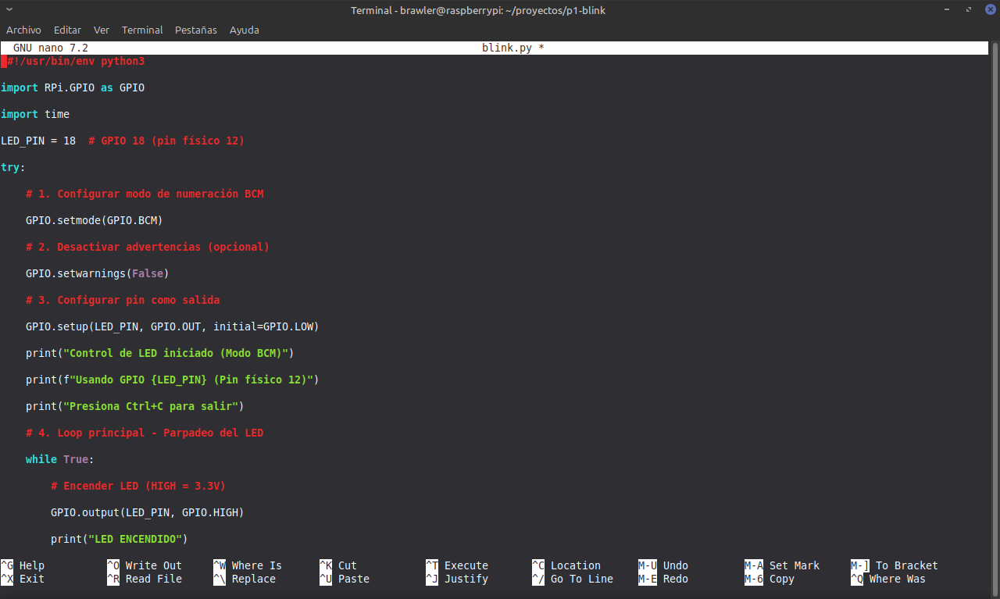
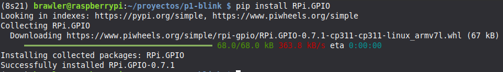
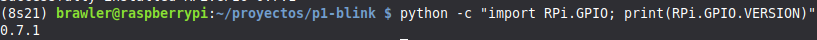
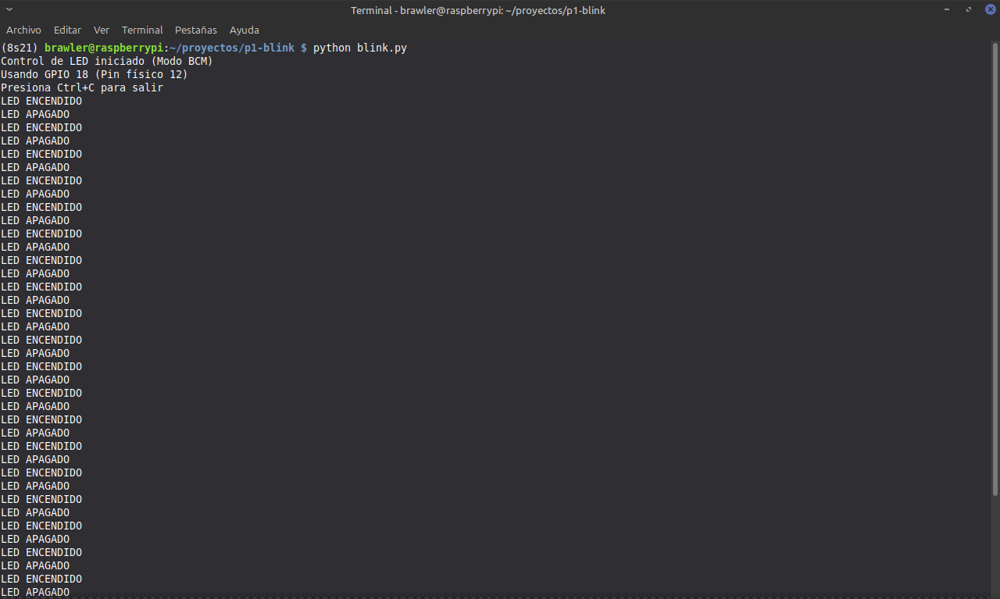
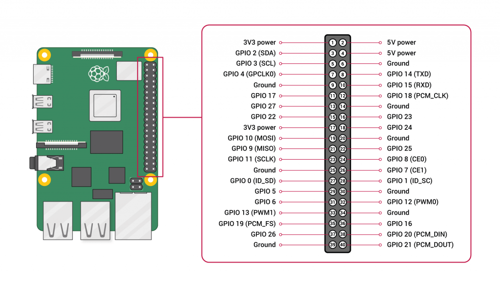
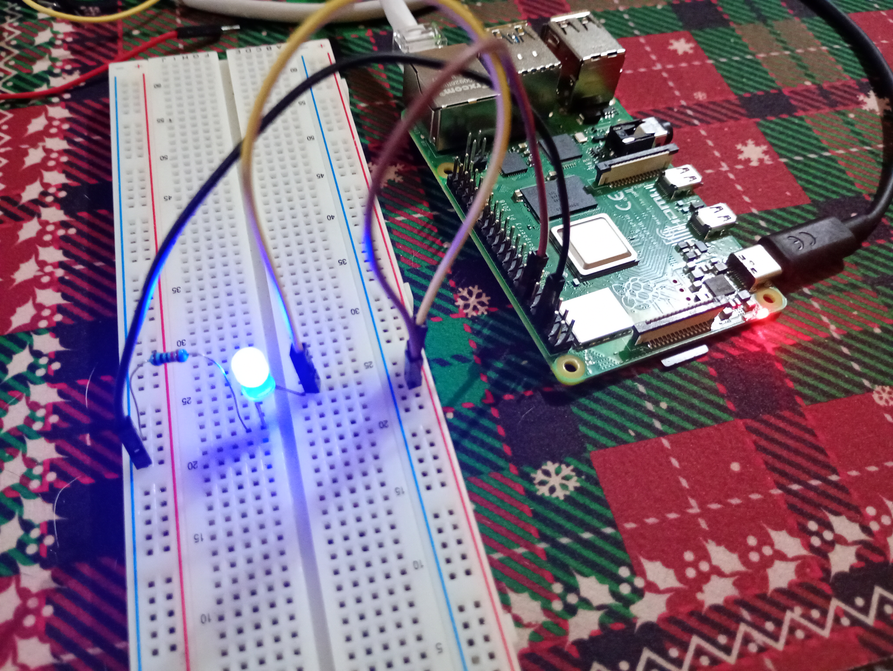
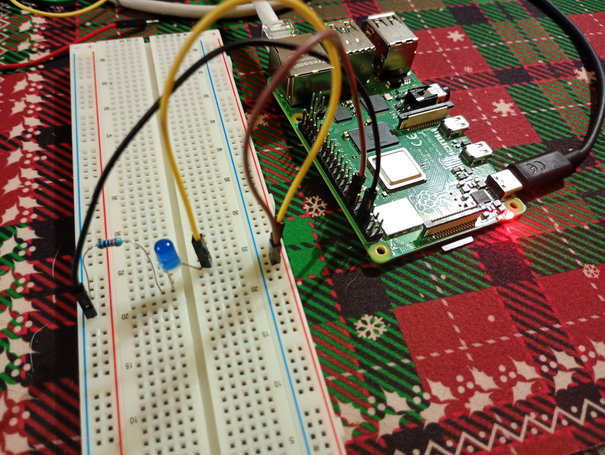

{width="4.939cm"
height="1.446cm"}{width="3.279cm"
height="3.279cm"}

**Practica 1 Led Blink**

**Nombre del docente:**\
Gustavo Moises Romero Gonzalez

**Materia:**

Sistemas Embebidos Aplicados a Móviles**\
**

**Nombre del alumno(a):**

\
Cabañas Santamaria Anel Athziri\
Miranda Martinez Alejandro\
Roldan Velazquez Ian Jurguen

Desarrollo de la Practica

1\. Creación de carpeta y archivo.

{width="17.59cm"
height="10.539cm"}\
Se creó un directorio dentro de proyectos para organizar el proyecto y
s{width="17.164cm"
height="4.77cm"}e utilizó el editor de texto *nano* para escribir el
script en Python.\
\
Aquí es donde se programa el script utilizando la librería Rpi.GPIO y el
modo numeración BCM.\
\
***Adjunto Programa:\
***

import RPi.GPIO as GPIO

import time

LED_PIN = 18  # GPIO 18 (pin físico 12)

try:

    \# 1. Configurar modo de numeración BCM

    GPIO.setmode(GPIO.BCM)

    \# 2. Desactivar advertencias (opcional)

    GPIO.setwarnings(False)

    \# 3. Configurar pin como salida

    GPIO.setup(LED_PIN, GPIO.OUT, initial=GPIO.LOW)

    print(\"Control de LED iniciado (Modo BCM)\")

    print(f\"Usando GPIO {LED_PIN} (Pin físico 12)\")

    print(\"Presiona Ctrl+C para salir\")

    \# 4. Loop principal - Parpadeo del LED

    while True:

        \# Encender LED (HIGH = 3.3V)

        GPIO.output(LED_PIN, GPIO.HIGH)

        print(\"LED ENCENDIDO\")

        time.sleep(1)

        \# Apagar LED (LOW = 0V)

        GPIO.output(LED_PIN, GPIO.LOW)

        print(\"LED APAGADO\")

        time.sleep(1)

except KeyboardInterrupt:

    print(\"\\nPrograma interrumpido por el usuario\")

finally:

    \# 5. Limpieza - Restaurar pines a estado seguro

    GPIO.cleanup()

    print(\"GPIO limpiado. Programa finalizado.\")

\
\
**2. Instalación de la librería.**

{width="18.336cm"
height="2.798cm"}\
Al ejecutar el código nos dará este anuncio ya que no hemos descargado
la librería Rpi.GPIO. En el código estamos utilizando esa librería por
ello proseguiremos a solucionarlo.\
\
Hacemos uso del comando pip install Rpi.GPIO como se ve aquí:\
{width="21.02cm"
height="3.048cm"}\

Y para verificar hacemos este comando phyton -c "import Rpi.GPIO;
print(RPi.GPIO.VERSION)" y nos mostrara la versión de la librería:\
\
\
\
{width="20.809cm"
height="1.018cm"}\
\
\
\
\
\
**3. Ejecución de programa y implementarlo en protoboard.**

**\
**Una vez resueltas las dependencias, se ejecutó el programa
exitosamente, observando la salida en consola que confirma el cambio de
estado del LED
(ENCENDIDO/APAGADO):{width="17.59cm"
height="10.539cm"}\
\
\
Ahora es momento de implementarlo en el protoboard, ocuparemos un led,
Jumpers (HEMBRA-MACHO, MACHO-MACHO), una resistencia de 220 ohms, un
protoboard y el Raspberry pi

Ocuparemos del Raspberry Pi 4 los siguientes pines:\
\
Pin Físico 12: Corresponde al GPIO 18. Es el pin encargado de enviar la
señal de 3.3V para encender el LED.

{width="17.59cm"
height="10.1cm"}Pin Físico 6: Corresponde a Ground (GND). Es el punto de
retorno de la corriente para cerrar el circuito.\
\
La conexión al protoboard es pin 12 al positivo y pin 6 al negativo con
los jumpers, lo siguiente es conectarle la resistencia de 220 ohms del
negativo al cátodo del LED y el ánodo un jumper al positivo.\
\
\
\
\
\
\
\
\
\
\
\
Aquí muestro el funcionamiento de la practica:\
\

LED PRENDIDO

{width="17.59cm"
height="13.243cm"}

LED APAGADO\
\
{width="17.59cm"
height="13.243cm"}\
\
***Conclusión:***\
\
Se logró el control de un periférico de salida mediante el Raspberry pi.
Se comprendió la importancia de la resistencia de limitación para
proteger los pines de la Raspberry Pi, los cuales operan a un nivel
lógico de 3.3V.
