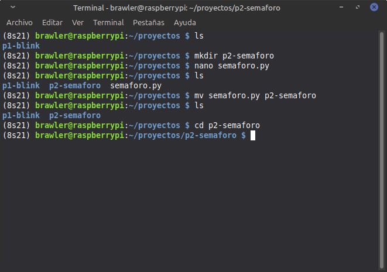
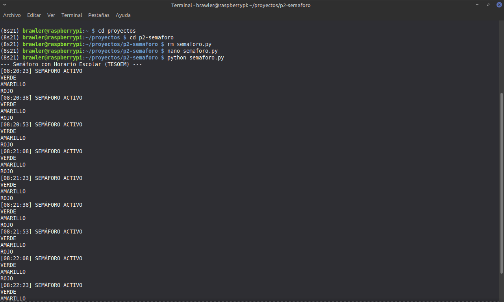
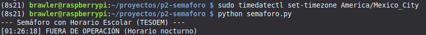
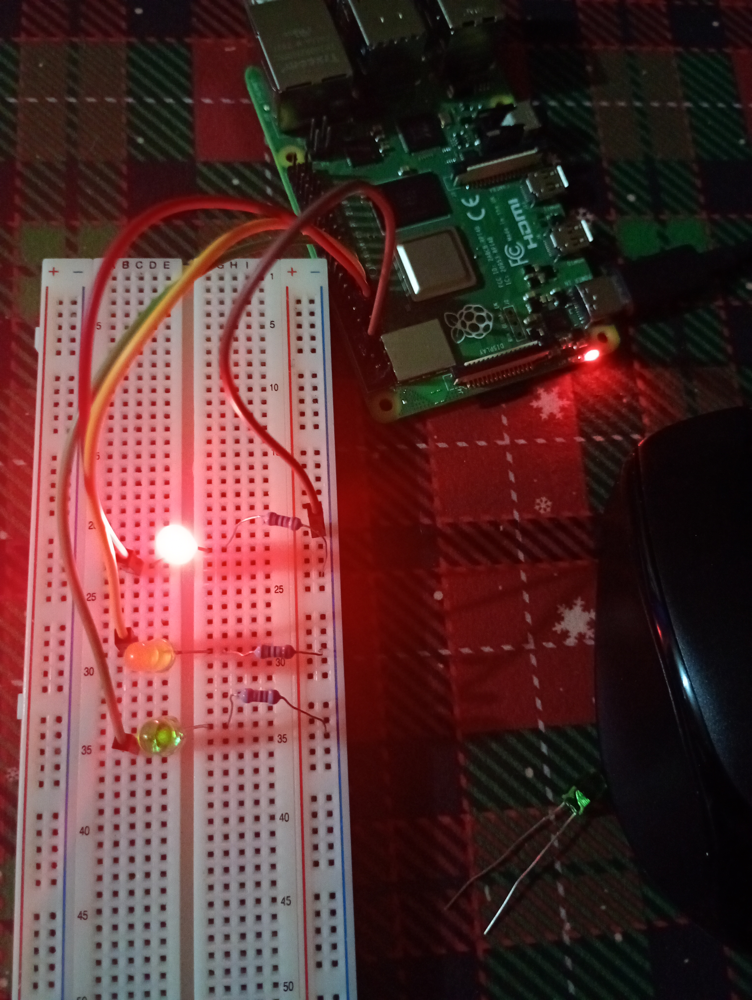
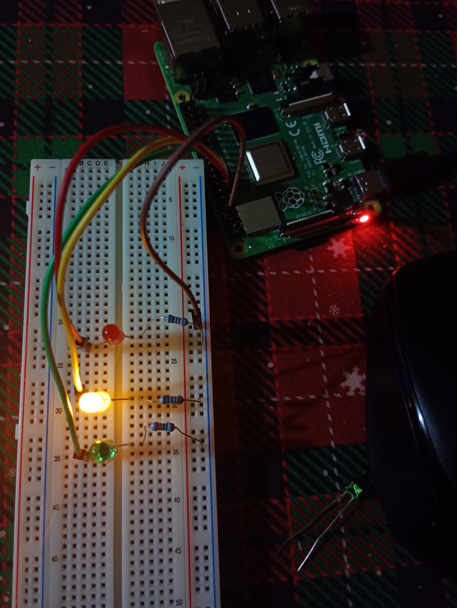
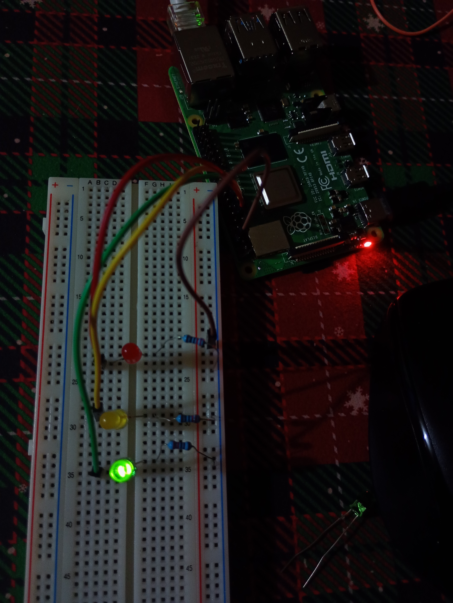

{width="1.94449in"
height="0.56929in"}{width="1.29094in"
height="1.29094in"}

**Practica 2 Semaforo de Leds**

**Nombre del docente:**\
Gustavo Moises Romero Gonzalez

**Materia:**

Sistemas Embebidos Aplicados a Móviles\

**Nombre del alumno(a):**

\
Cabañas Santamaria Anel Athziri\
Miranda Martinez Alejandro\
Roldan Velazquez Ian Jurguen

Desarrollo de la Práctica

¿Qué se hará? Se realizara un proceso de simulación de semáforo con 3
leds conectados a la Raspberry, el programa sera codificado en python y
simulara con tiempos específicos el funcionamiento del mismo, como
mejora se agregara tiempo nocturno, donde el semáforo queda fuera de
operación hasta las 5 hrs del dia siguiente e inhabilitado a las 22 hrs
del dia corriente.

1\. Creación de carpeta y archivo.

\
Se creó un directorio dentro de proyectos para organizar el proyecto y
se {width="5.25472in" height="3.69646in"}utilizó el
editor de texto *nano* para escribir el script en Python.\
\
Aquí es donde se programa el script utilizando la librería Rpi.GPIO.\
\
***Adjunto Programa:***\

import RPi.GPIO as GPIO

import time

from datetime import datetime \# Para revisar la hora del sistema

ROJO, AMARILLO, VERDE = 17, 27, 22

GPIO.setmode(GPIO.BCM)

GPIO.setwarnings(False)

GPIO.setup(\[ROJO, AMARILLO, VERDE\], GPIO.OUT, initial=GPIO.LOW)

def apagar_todo():

GPIO.output(\[ROJO, AMARILLO, VERDE\], GPIO.LOW)

try:

print(\"\-\-- Semáforo con Horario Escolar (TESOEM) \-\--\")

while True:

\# 1. Obtener la hora actual

ahora = datetime.now().hour

\# 2. Verificar condición: Funciona de 5:00 AM a 9:59 PM (22 hrs)

if 5 \<= ahora \< 22:

print(f\"\[{datetime.now().strftime(\'%H:%M:%S\')}\] SEMÁFORO ACTIVO\")

GPIO.output(VERDE, GPIO.HIGH)

print(\"VERDE\")

time.sleep(5)

\# Parpadeo verde

for \_ in range(3):

GPIO.output(VERDE, GPIO.LOW); time.sleep(0.5)

GPIO.output(VERDE, GPIO.HIGH); time.sleep(0.5)

GPIO.output(VERDE, GPIO.LOW)

GPIO.output(AMARILLO, GPIO.HIGH)

print(\"AMARILLO\")

time.sleep(2)

GPIO.output(AMARILLO, GPIO.LOW)

GPIO.output(ROJO, GPIO.HIGH)

print(\"ROJO\")

time.sleep(5)

GPIO.output(ROJO, GPIO.LOW)

else:

\# \-\-- FUERA DE SERVICIO (22:00 a 04:59) \-\--

print(f\"\[{datetime.now().strftime(\'%H:%M:%S\')}\] FUERA DE OPERACIÓN
(Horario nocturno)\")

apagar_todo()

time.sleep(60) \# Revisa cada minuto si ya son las 5 AM

except KeyboardInterrupt:

print(\"\\nPrograma detenido\")

finally:

GPIO.cleanup()

\
**2. Instalación de la librería.**

{width="7.2189in" height="1.10157in"}\
Al ejecutar el código nos dará este anuncio como la ves anterior por eso
se debe tener instalado la librería dentro de esa carpeta.\
\
Hacemos uso del comando pip install Rpi.GPIO como se ve aquí:\
{width="8.27559in" height="1.2in"}\
\
\
\
\
\
\
\
\
\
\
\
\
\
\
\
\
\
\
**3. Ejecución de programa y implementarlo en protoboard.**

\
Una vez resueltas las dependencias, se ejecutó el programa exitosamente,
observando la salida en consola que confirma el cambio de estado del LED
si es Verde, Amarillo o Rojo:\
{width="6.9252in" height="4.14921in"}\
\
Pero también se debe detectar que el programa este corriendo en tu país
y no fuera de ya que por default la importación de time da la de Londres
en eso entramos a corregirlo metiendo la de México:

\
Metemos el comando: sudo timedatectl set-timezone America/Mexico_City\
Aqui se ve que ya metiendolo nos da la hora correcta y se ve que cumple
con lo establecido que es estar fuera de operación el semaforo por la
hora\
{width="7.82717in" height="0.65in"}\
\

Ahora es momento de implementarlo en el protoboard, ocuparemos tres
leds, Jumpers (HEMBRA-MACHO), tres resistencias de 220 ohms, un
protoboard y el Raspberry pi.

Ocuparemos del Raspberry Pi 4 los siguientes pines:\
\
Pin Físico 11: Corresponde al GPIO 17. Es el pin encargado de enviar la
señal de 3.3V para encender el LED Rojo.

Pin Físico 13: Corresponde al GPIO 27. Es el pin encargado de enviar la
señal de 3.3V para encender el LED Amarillo.

Pin Físico 15: Corresponde al GPIO 22. Es el pin encargado de enviar la
señal de 3.3V para encender el LED Verde.

{width="6.9252in" height="3.97638in"}Pin Físico 6:
Corresponde a Ground (GND). Es el punto de retorno de la corriente para
cerrar el circuito.\
\

La conexión al protoboard es: pin 11 al ánodo del LED Rojo, pin 13 al
ánodo del LED Amarillo, pin 15 al ánodo del LED Verde y pin 6 al
negativo con los jumpers, lo siguiente es conectarle la resistencia de
220 ohms del negativo al cátodo de cada LED.\
\
\
\
\

Aquí muestro el funcionamiento de la practica:

LED Rojo

{width="5.44724in" height="7.23465in"}

\
\
\
\
\
\
\
\
\
\
\
\
\

LED Amarillo

{width="4.97717in" height="5.95709in"}\
\
\
\
\
\
\
\
\
\

*** ***

\

LED Verde\
\
{width="5.23898in" height="6.95748in"}\

\
***Conclusión:***\
Se logró el control de un periférico de salida mediante el Raspberry pi.
Se implemento la hora de nuestra ciudad por medio de un comando y
resultara de forma correcta el semáforo respetando estar fuera de
operación durante la hora establecida.
