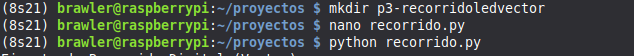
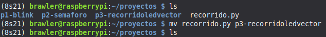
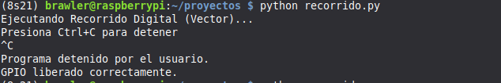
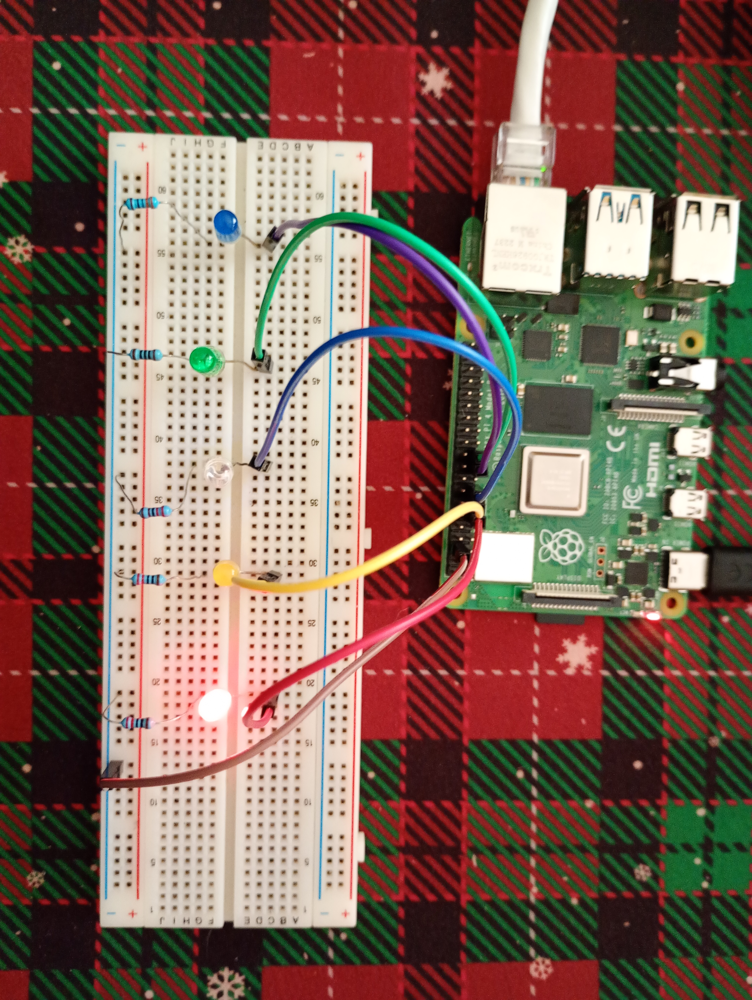
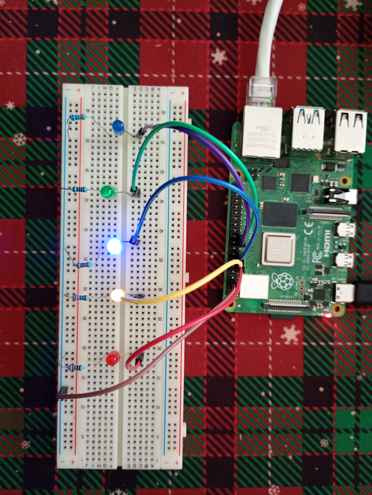
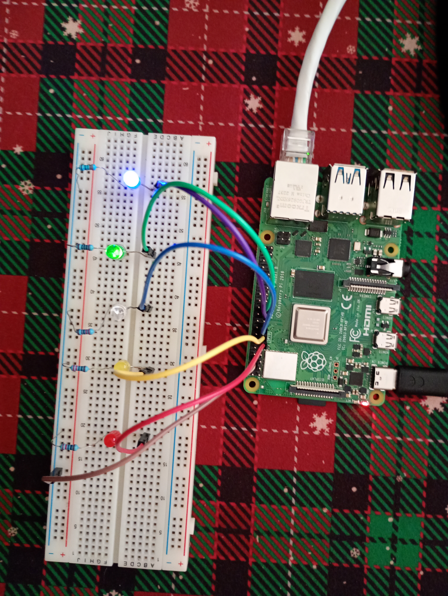

{width="4.939cm"
height="1.446cm"}{width="3.279cm"
height="3.279cm"}

**Práctica 3 Recorrido de Leds Vector**

**Nombre del docente:**\
Gustavo Moises Romero Gonzalez

**Materia:**

Sistemas Embebidos Aplicados a Móviles**\
**

**Nombre del alumno(a):**

\
Cabañas Santamaria Anel Athziri\
Miranda Martinez Alejandro\
Roldan Velazquez Ian Jurguen

Desarrollo de la Práctica

¿Qué se hará? Se realizara un proceso de recorrido LED, controlado
mediante un programa Python que emplee el uso de un vector de control
GPIO.

1\. Creación de carpeta y archivo.

{width="16.773cm"
height="1.452cm"}\
{width="16.775cm"
height="1.912cm"}Se creó un directorio dentro de proyectos para
organizar el proyecto y se utilizó el editor de texto *nano* para
escribir el script en Python.\
\
\
***Adjunto Programa:\
***

iimport RPi.GPIO as GPIO

import time

pines = \[17, 27, 22, 10, 9\]

GPIO.setmode(GPIO.BCM)

GPIO.setwarnings(False)

for pin in pines:

GPIO.setup(pin, GPIO.OUT, initial=GPIO.LOW)

try:

print(\"Ejecutando Recorrido Digital (Vector)\...\")

print(\"Presiona Ctrl+C para detener\")

while True:

\# Recorrido de IDA

for pin in pines:

GPIO.output(pin, GPIO.HIGH) \# Enciende

time.sleep(0.1) \# Espera

GPIO.output(pin, GPIO.LOW) \# Apaga

\# Recorrido de VUELTA (usando la función reversed)

for pin in reversed(pines):

GPIO.output(pin, GPIO.HIGH)

time.sleep(0.1)

GPIO.output(pin, GPIO.LOW)

except KeyboardInterrupt:

print(\"\\nPrograma detenido por el usuario.\")

finally:

GPIO.cleanup()

print(\"GPIO liberado correctamente.\")

\
**2. Instalación de la librería.**

{width="18.336cm"
height="2.798cm"}\
Al ejecutar el código nos dará este anuncio como la ves anterior por eso
se debe tener instalado la librería dentro de esa carpeta.\
\
Hacemos uso del comando pip install Rpi.GPIO como se ve aquí:\
{width="21.02cm"
height="3.048cm"}\
\
\
\
\
\
\
\
\
\
\
\
\
\
\
\
\
\
\
**3. Ejecución de programa y implementarlo en protoboard.**

**\
**Una vez resueltas las dependencias, se ejecutó el programa
exitosamente, observando que el programa lo hace en el protoboard:\
\
\
\
{width="16.775cm"
height="2.78cm"}

Asi de debe estar imlementado en el protoboard, ocuparemos 5 leds,
Jumpers (HEMBRA-MACHO), 5 resistencias de 220 ohms, un protoboard y el
Raspberry pi.

Ocuparemos del Raspberry Pi 4 los siguientes pines:\
\
Pin Físico 11: Corresponde al GPIO 17. Es el pin encargado de enviar la
señal de 3.3V para encender el LED Rojo.

Pin Físico 13: Corresponde al GPIO 27. Es el pin encargado de enviar la
señal de 3.3V para encender el LED Amarillo.

Pin Físico 15: Corresponde al GPIO 22. Es el pin encargado de enviar la
señal de 3.3V para encender el LED Azul.

Pin Físico 19: Corresponde al GPIO 10. Es el pin encargado de enviar la
señal de 3.3V para encender el LED Verde.

Pin Físico 21: Corresponde al GPIO 9. Es el pin encargado de enviar la
señal de 3.3V para encender el LED Azul.

{width="17.59cm"
height="10.1cm"}Pin Físico 6: Corresponde a Ground (GND). Es el punto de
retorno de la corriente para cerrar el circuito.\
\

La conexión al protoboard es: los pines 11, 13, 15, 19 y 21 con el
jumper sera conectado a cada LED, lo siguiente es conectarle la
resistencia de 220 ohms del negativo al cátodo de cada LED y conectar el
pin 6 al lado negativo.\
\
\

{width="17.59cm"
height="23.361cm"}Aquí muestro el funcionamiento de la practica:

***\
\
\
\
***{width="13.238cm"
height="17.582cm"}***\
\
\
\
\
\
\
\
\
\
\
\
\
\
\
\
\
\
\
\
\
\
\
\
\
\
\
***{width="13.259cm"
height="17.609cm"}

***Conclusión:***\
Se realizó la implementación de un vector de control dentro del código
de Python para gestionar de manera eficiente múltiples salidas
digitales. Mediante el uso de estructuras iterativas (ciclos for) y el
manejo de índices en la lista de pines, se logró un flujo secuencial
bidireccional, demostrando la escalabilidad del software al controlar
diversos periféricos con un bloque de código optimizado.
